# My Projects
This repo is for showcasing my personal projects and documenting the tools, technologies, and concepts I've worked with.

1. [RESCUEME: An Innovative Real-Time Wearable Emergency Mobile Application Utilizing LoRa Technology](#rescueme-an-innovative-real-time-wearable-emergency-mobile-application-utilizing-lora-technology)
2. [My Priorities - Mobile Notes App with Offline/Online Storage](#my-priorities---mobile-notes-app-with-offline-online-storage)
3. [3DPrinting - Landing Page Website for Business](#3dprinting---landing-page-website-for-business)
4. [Scheduling System](#scheduling-system)

## RESCUEME: An Innovative Real-Time Wearable Emergency Mobile Application Utilizing LoRa Technology
### Technology Used:
- C++
- React Native
- Expo
- TypeScript
- Mapbox
- LoRa – RYLR896
- ESP8266 NODE MCU
- NEO-M8N GPS
### Description:
- Develop a prototype device that can be used in emergency and search and rescue operations.
- Consists of GPS tracking device(receiver), transmitter device and mobile app map that can be used in search and rescue operation.
- A transmitter device that uses uBlox GPS technology that send coordinates via radio frequency using LoRa - RYLR896 and ESP8266 NODE MCU as controller.
- Transmitter didn’t need any internet connections to send coordinates but need a line of sight (LOS) for clear communication between two devices and clear sky to receive a coordinate from satellite.
- Maximum of 16 km radius range with line of sight (LOS).
- Uses a mobile app map that monitor the current position of the transmitter real time.
### Images and Video:

  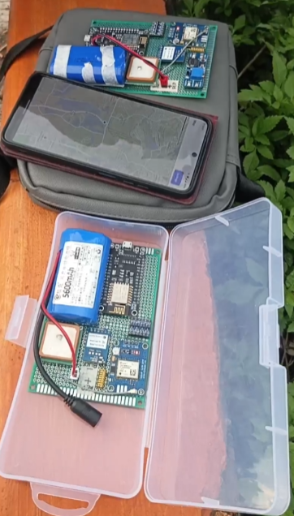
  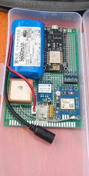
  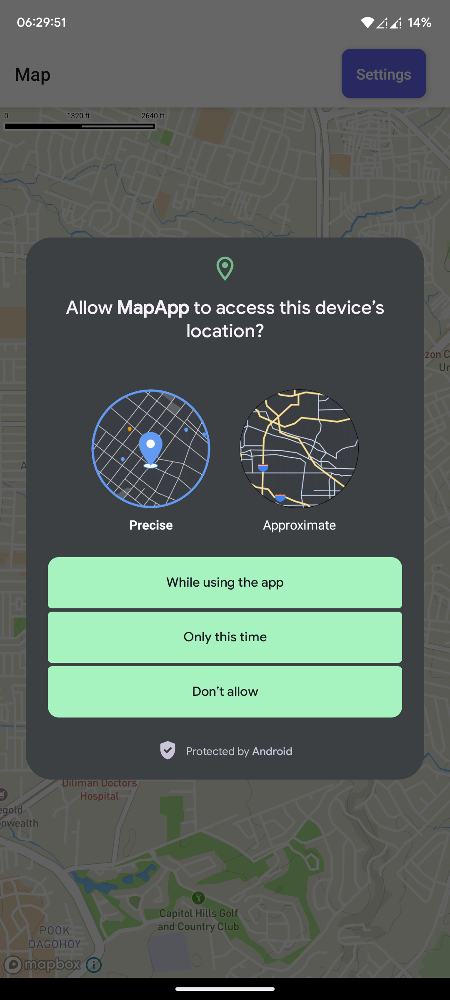
  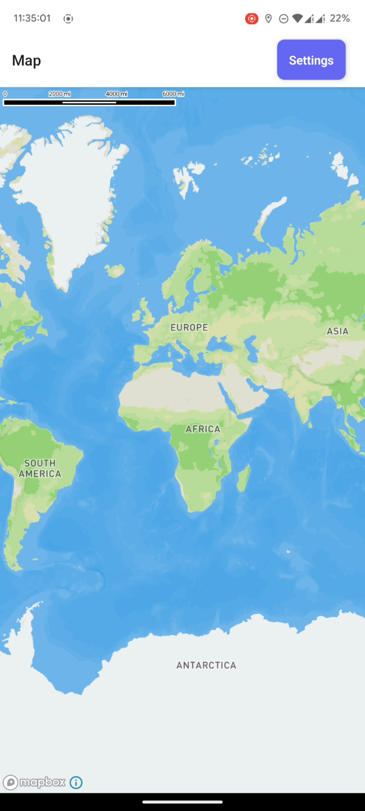
  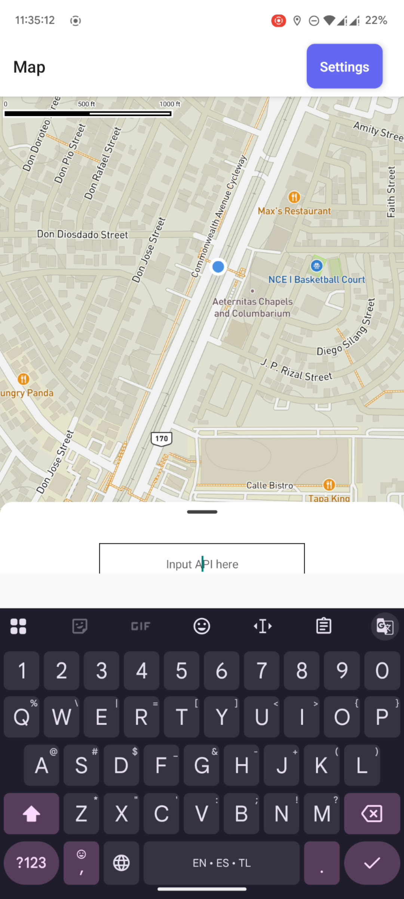
  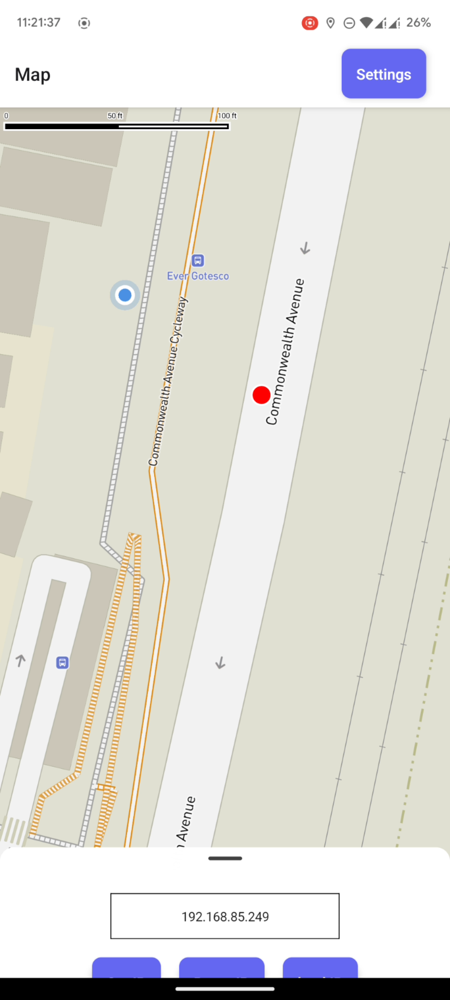
  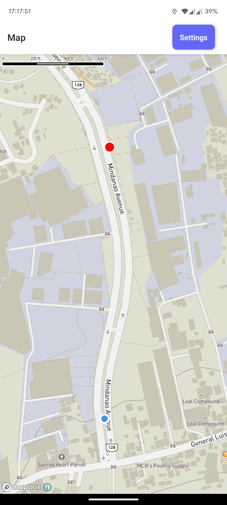
  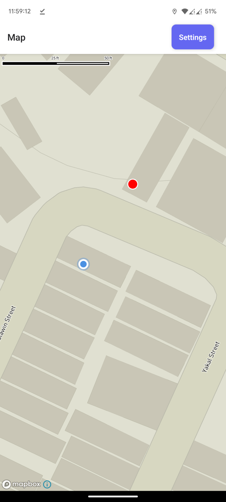
  <a href="https://www.youtube.com/shorts/BjV5wS_tZSg">
    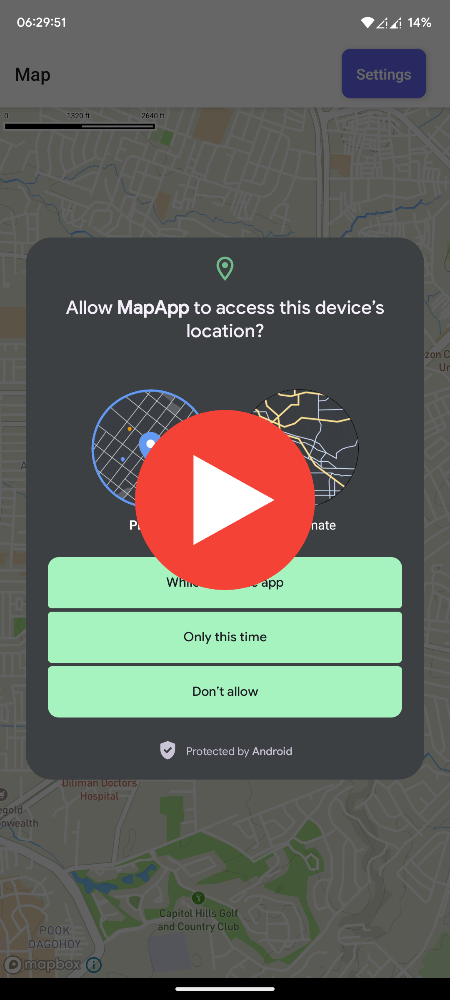
  </a>

## My Priorities - Mobile Notes App with Offline-Online Storage
### Tech Stack Used: 
- React Native
- Expo
- TypeScript
- Firebase
### Description
- Categorized note management (e.g., Work, Health, Finance). Types of notes (e.g., Quick Note, Daily, Reminder, Priorities).
- Scheduled alarms & reminders using Notifee.
- Deep linking from notifications to specific app screens.
- Offline support with encrypted local storage and caching (MMKV/AsyncStorage).
- Firebase Firestore sync and user authentication.
### Images and Video:

  
  
  
  
  
  
  
  
  
  
  
  
  
  
  
  
  <a href="https://www.youtube.com/shorts/tnsJoVOPMWs">
    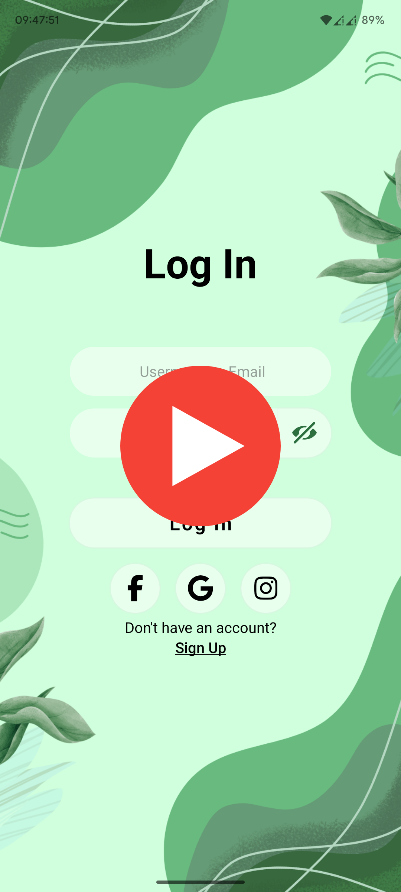
  </a>
  <a href="https://www.youtube.com/shorts/2LgiqArXqZY">
    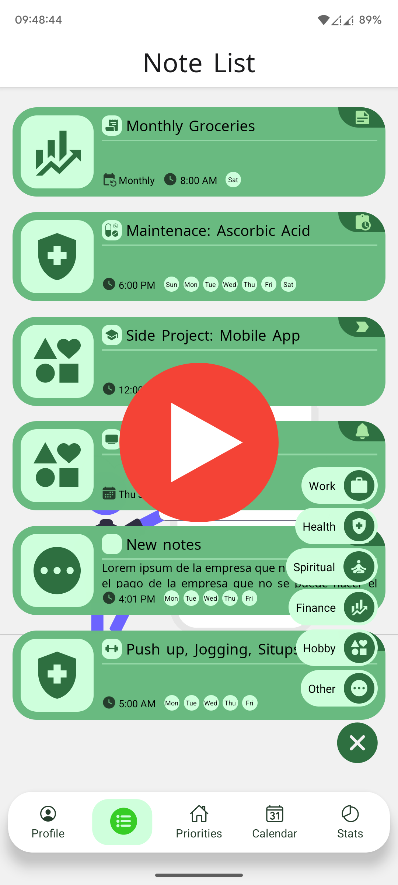
  </a>

## 3DPrinting - Landing Page Website for Business
### Tech Stack Used: 
-  React
-  JavaScript
-  Vue
-  Tailwind CSS
### Description
- Task Management: From the presented interface users can create, modify, delete, as well as prioritize tasks.
- Appointment Scheduling: One is able to make and manage appointments with the help of a calendar view.
- Automatic Reminders: It also helps in sending email reminder within a near deadline.
- Database Connectivity: User information, tasks and appointments stored in MS. Access Server which is useful for future use.
- Firebase Firestore sync and user authentication.
### Images and Video:

## Scheduling System
### Tech Stack Used: 
- vb.net
### Description
- Task Management: From the presented interface users can create, modify, delete, as well as prioritize tasks.
- Appointment Scheduling: One is able to make and manage appointments with the help of a calendar view.
- Automatic Reminders: It also helps in sending email reminder within a near deadline.
- Database Connectivity: User information, tasks and appointments stored in MS. Access Server which is useful for future use.
- Firebase Firestore sync and user authentication.
### Images and Video:
